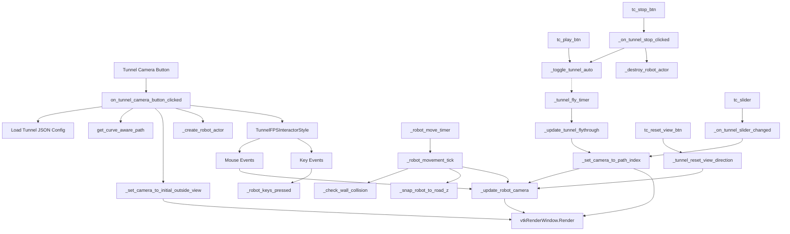

# Tunnel Camera View Analysis Report

This document contains a comprehensive read-only code analysis of the **Tunnel Camera View** feature.

## 1. Feature Analysis

### 1. Tunnel Camera View button click
* **File:** `application_ui.py`
* **Class:** `ApplicationUI`
* **Function:** `on_tunnel_camera_button_clicked`
* **Line:** ~5841
* **Who calls this:** Triggered by `tunnel_camera_button` click event (Line ~2455).
* **Which functions it calls next:** `get_curve_aware_path`, `_set_camera_to_initial_outside_view`, `_create_robot_actor` (if robot active), `update_3d_button_position`. Starts `_tunnel_fly_timer` QTimer.
* **Which variables it reads/writes:** Reads `current_design_layer_path`, `current_subfolder_type`, `zero_start_km`. Writes `_tunnel_camera_target`, `_tunnel_centerline`, `_tunnel_forward_dir`, `_tunnel_center_point`, `_fly_path`, `_tunnel_entry_idx`, `_tunnel_entry_pos`, `_tunnel_entry_fwd`, `_pre_entry_offset`, `_fly_speed`, `_fly_idx`, `_fly_t`, `_saved_interactor_style`, `_saved_picker`, `_tunnel_fps_style`.
* **UI element:** `tunnel_camera_button` (QPushButton)
* **Impact:** ⭐ Critical. Initiates the entire Tunnel Camera mode, loads tunnel JSON, parses path, sets clipping ranges, applies new Interactor style, and triggers rendering loop.

### 2. Camera initialization and positioning
* **File:** `application_ui.py`
* **Class:** `ApplicationUI`
* **Function:** `_set_camera_to_initial_outside_view`
* **Line:** ~6397
* **Who calls this:** `on_tunnel_camera_button_clicked`, `_on_tunnel_slider_changed`, `_on_tunnel_stop_clicked`, `_reset_tunnel_camera`
* **Which functions it calls next:** `_update_robot_camera` (if robot mode), `camera.SetPosition`, `camera.SetFocalPoint`, `fps.set_locked_position`, `vtk_widget.GetRenderWindow().Render()`
* **Which variables it reads/writes:** Reads `_fly_path`, `_tunnel_entry_pos`, `_tunnel_entry_fwd`, `_pre_entry_offset`, `_tunnel_h_val`. Writes `_initial_cam_pos`, `_robot_position`, `_robot_yaw`.
* **UI element:** Triggered indirectly by multiple Tunnel Camera UI controls.
* **Impact:** ⭐ Critical. Defines the initial exterior viewpoint looking into the tunnel entrance.

### 3. Auto button functionality
* **File:** `application_ui.py`
* **Class:** `ApplicationUI`
* **Function:** `_toggle_tunnel_auto`
* **Line:** ~6151
* **Who calls this:** Triggered by `tc_play_btn` check state change, or programmatically when path ends.
* **Which functions it calls next:** `camera.SetPosition`, `camera.SetFocalPoint`, `interactor.SetInteractorStyle`, `_tunnel_fly_timer.start(33)` or `stop()`.
* **Which variables it reads/writes:** Reads `_saved_tunnel_cam_pos`, `_saved_tunnel_cam_fp`. Clears these variables upon resuming.
* **UI element:** `tc_play_btn` (QPushButton toggle)
* **Impact:** ⚠ Important. Controls the automated flythrough loop.

### 4. Stop button functionality
* **File:** `application_ui.py`
* **Class:** `ApplicationUI`
* **Function:** `_on_tunnel_stop_clicked`
* **Line:** ~6209
* **Who calls this:** Triggered by `tc_stop_btn`.
* **Which functions it calls next:** `_toggle_tunnel_auto`, `_destroy_robot_actor`, `_set_camera_to_initial_outside_view`.
* **Which variables it reads/writes:** Reads/Writes `_saved_tunnel_cam_pos`, `_saved_tunnel_cam_fp`. Clears `_saved_interactor_style`.
* **UI element:** `tc_stop_btn`
* **Impact:** ⚠ Important. Pauses animation and snaps to overview, saving state.

### 5. Slider functionality
* **File:** `application_ui.py`
* **Class:** `ApplicationUI`
* **Function:** `_on_tunnel_slider_changed`
* **Line:** ~6183
* **Who calls this:** Triggered by `tc_slider` `valueChanged` signal (Line ~2579).
* **Which functions it calls next:** `_set_camera_to_initial_outside_view` (if 0), `_set_camera_to_path_index`
* **Which variables it reads/writes:** Reads `_fly_path`. Writes `_fly_idx`, `_fly_t`. Clears `_saved_tunnel_cam_pos`.
* **UI element:** `tc_slider` (QSlider)
* **Impact:** ⚠ Important. Seeks flythrough path.

### 6. Reset All Arrows button
* **File:** `pointcloudviewer.py`
* **Class:** `PointCloudViewer`
* **Function:** `reset_all`
* **Line:** ~12612
* **Who calls this:** Triggered by `reset_all_button` (Line ~12065 in `pointcloudviewer.py`, or ~2062 in `application_ui.py`)
* **Which functions it calls next:** Clears actors and calls `self.vtk_widget.GetRenderWindow().Render()`
* **Which variables it reads/writes:** Modifies measurement actors, lists, and active states.
* **UI element:** `reset_all_button` (QPushButton)
* **Impact:** ✓ Support. Indirectly affects tunnel camera by clearing clutter from the view, but doesn't change camera logic.

### 7. Reset View Direction button
* **File:** `application_ui.py`
* **Class:** `ApplicationUI`
* **Function:** `_tunnel_reset_view_direction`
* **Line:** ~6343
* **Who calls this:** Triggered by `tc_reset_view_btn` (Line ~2585).
* **Which functions it calls next:** `_update_robot_camera` (if robot active), `camera.SetFocalPoint`, `vtk_widget.GetRenderWindow().Render()`
* **Which variables it reads/writes:** Reads `_fly_idx`, `_tunnel_entry_idx`, `_fly_path`. Writes `_robot_yaw`, `_robot_pitch`.
* **UI element:** `tc_reset_view_btn`
* **Impact:** ⚠ Important. Re-aligns user's view forward along the tunnel path after they have looked around.

### 8. Mouse Scroll Wheel (Zoom) functionality
* **File:** `application_ui.py`
* **Class:** `TunnelFPSInteractorStyle`
* **Function:** `_on_mouse_wheel_forward` / `_on_mouse_wheel_backward`
* **Line:** ~164, ~189
* **Who calls this:** Triggered by VTK `MouseWheelForwardEvent` / `MouseWheelBackwardEvent` observers.
* **Which functions it calls next:** `_viewer._check_wall_collision`, `_viewer._snap_robot_to_road_z`, `_viewer._update_robot_camera`
* **Which variables it reads/writes:** Reads `SCROLL_STEP_DISTANCE`, `_viewer._robot_yaw`. Writes `_viewer._robot_position`.
* **UI element:** Mouse Scroll Wheel on VTK canvas.
* **Impact:** ⚠ Important. Drives the robot forward/backward along view vector (only active in robot mode).

### 9. Mouse drag/orbit/pan interactions
* **File:** `application_ui.py`
* **Class:** `TunnelFPSInteractorStyle`
* **Function:** `_on_mouse_move`
* **Line:** ~215
* **Who calls this:** VTK `MouseMoveEvent` observer.
* **Which functions it calls next:** `_viewer._check_wall_collision`, `_viewer._snap_robot_to_road_z`, `_viewer._update_robot_camera`, `_enforce_position`
* **Which variables it reads/writes:** Reads/Writes `_last_x`, `_last_y`. Reads `_sensitivity_look`, `_sensitivity_move`. Writes `_viewer._robot_yaw`, `_viewer._robot_pitch`, `_viewer._robot_position` (Robot Mode). Modifies Camera Focal Point (Legacy mode).
* **UI element:** Mouse drag on VTK canvas (RMB, MMB, LMB).
* **Impact:** ⭐ Critical. Handles FPS look around and strafing.

### 10. Robot movement functionality
* **File:** `pointcloudviewer.py`
* **Class:** `PointCloudViewer`
* **Function:** `_robot_movement_tick`
* **Line:** ~39001
* **Who calls this:** `_robot_move_timer` QTimer timeout.
* **Which functions it calls next:** `_check_wall_collision`, `_snap_robot_to_road_z`, `_update_robot_camera`
* **Which variables it reads/writes:** Reads `_robot_keys_pressed`, `_robot_speed`. Writes `_robot_position`, `_robot_yaw`.
* **UI element:** Timer and Keyboard State.
* **Impact:** ⭐ Critical. Drives the physics/movement loop for the robot character.

### 11. Camera following robot
* **File:** `pointcloudviewer.py`
* **Class:** `PointCloudViewer`
* **Function:** `_update_robot_camera`
* **Line:** ~39154
* **Who calls this:** `_robot_movement_tick`, `_on_mouse_wheel_forward`, `_on_mouse_move`, `_tunnel_reset_view_direction`.
* **Which functions it calls next:** `camera.SetPosition`, `camera.SetFocalPoint`, `fps.set_locked_position`.
* **Which variables it reads/writes:** Reads `_robot_position`, `_robot_yaw`, `_robot_pitch`, `_robot_cam_offset_back`, `_robot_cam_offset_up`.
* **UI element:** None directly.
* **Impact:** ⭐ Critical. Attaches the VTK camera to the robot actor dynamically in 3rd-person perspective.

### 12. Keyboard controls
* **File:** `application_ui.py`
* **Class:** `TunnelFPSInteractorStyle`
* **Function:** `_on_key_press` / `_on_key_release`
* **Line:** ~140, ~154
* **Who calls this:** VTK `KeyPressEvent` / `KeyReleaseEvent` observers.
* **Which functions it calls next:** None directly; modifies state.
* **Which variables it reads/writes:** Modifies `_viewer._robot_keys_pressed` set (adds/removes 'w', 'a', 's', 'd', 'left', 'right').
* **UI element:** Keyboard.
* **Impact:** ⚠ Important. Enables WASD navigation in Robot Mode.

### 13. Camera update/render loop
* **File:** `application_ui.py`
* **Class:** `ApplicationUI`
* **Function:** `_update_tunnel_flythrough`
* **Line:** ~6124
* **Who calls this:** `_tunnel_fly_timer` timeout (Auto Mode).
* **Which functions it calls next:** `_set_camera_to_path_index`
* **Which variables it reads/writes:** Reads/Writes `_fly_t`, `_fly_idx`. Modifies `tc_slider` value.
* **UI element:** Timer.
* **Impact:** ⭐ Critical. The core engine for automated flythrough.

### 14. Timer-based camera updates
* **Variables/Objects:** `self._tunnel_fly_timer` (for flythrough), `self._robot_move_timer` (for robot).
* **Impact:** ⭐ Critical. Both QTimers run roughly at 33ms (~30 FPS) causing the scene to render and camera/robot to update continuously.

### 15. Camera interpolation/animation
* **File:** `application_ui.py`
* **Class:** `ApplicationUI`
* **Function:** `_set_camera_to_path_index`
* **Line:** ~6470
* **Who calls this:** `_update_tunnel_flythrough`, `_on_tunnel_slider_changed`
* **Which functions it calls next:** `camera.SetPosition`, `camera.SetFocalPoint`, `_update_robot_camera` (if robot active).
* **Which variables it reads/writes:** Interpolates between points in `_fly_path` using index `idx` and fraction `t`. Uses `_tunnel_h_val` for Z bounds.
* **Impact:** ⭐ Critical. Smoothly moves the view along the pre-calculated centerline points.

### 16. Camera clipping/focal point updates
* **Details:** Handled primarily inside `on_tunnel_camera_button_clicked` (`SetClippingRange(0.5, tunnel_length_safe + 200.0)`) and `_set_camera_to_path_index`/`_update_robot_camera` (`camera.SetFocalPoint`).
* **Impact:** ⚠ Important. Prevents near/far clipping issues inside the long tunnel mesh.

### 17. Tunnel FPS/Interactor Style
* **File:** `application_ui.py`
* **Class:** `TunnelFPSInteractorStyle`
* **Line:** ~38
* **Impact:** ⭐ Critical. Subclasses `vtkInteractorStyleUser` to lock camera position to the path (legacy) or robot, while allowing focal point rotation.

### 18. Any VTK camera-related callbacks
* **Observers:** `LeftButtonPressEvent`, `LeftButtonReleaseEvent`, `RightButtonPressEvent`, `RightButtonReleaseEvent`, `MiddleButtonPressEvent`, `MiddleButtonReleaseEvent`, `MouseMoveEvent`, `MouseWheelForwardEvent`, `MouseWheelBackwardEvent`, `KeyPressEvent`, `KeyReleaseEvent`.
* **Impact:** ⭐ Critical. Intercepts VTK interactions to override default trackball behaviour with FPS/Robot logic.

### 19. Any signal-slot connections related to Tunnel Camera View
* `self.tunnel_camera_button.clicked.connect(self.on_tunnel_camera_button_clicked)`
* `self.tc_reset_btn.clicked.connect(self._reset_tunnel_camera)`
* `self.tc_play_btn.clicked.connect(self._toggle_tunnel_auto)` (Inferred)
* `self.tc_stop_btn.clicked.connect(self._on_tunnel_stop_clicked)` (Inferred)
* `self.tc_slider.valueChanged.connect(self._on_tunnel_slider_changed)`
* `self.tc_reset_view_btn.clicked.connect(self._tunnel_reset_view_direction)`
* `self._tunnel_fly_timer.timeout.connect(self._update_tunnel_flythrough)`
* `self._robot_move_timer.timeout.connect(self._robot_movement_tick)`

### 20. Any JSON/config values affecting Tunnel Camera View
* **Files:** `design_construction_config.json` or Merger JSONs.
* **Keys:** `design.tunnel.start_km`, `design.tunnel.start_chainage`, `design.tunnel.end_km`, `design.tunnel.end_chainage`, `design.tunnel.wall_thickness`, `design.tunnel.tunnel_height` (or `height`, `arch_radius`, `radius`), `design.tunnel.road_width`.
* **Impact:** ⭐ Critical. These parameters dictate the path start/end, width for wall collisions, and roof height for camera clamping.

---

## 2. Dependency Map

---

## 3. Critical Functions
Functions that MUST be modified if Tunnel Camera View behavior is changed.

* ⭐ `ApplicationUI.on_tunnel_camera_button_clicked` (Initialization, path building)
* ⭐ `ApplicationUI._set_camera_to_path_index` (Core camera position algorithm)
* ⭐ `PointCloudViewer._robot_movement_tick` (Robot physics & WASD logic)
* ⭐ `PointCloudViewer._update_robot_camera` (3rd person camera tracking)
* ⭐ `TunnelFPSInteractorStyle._on_mouse_move` (Look around and drag-to-move)
* ⚠ `ApplicationUI._set_camera_to_initial_outside_view` (Entry point logic)
* ⚠ `PointCloudViewer._check_wall_collision` (Boundary enforcement)
* ⚠ `PointCloudViewer._snap_robot_to_road_z` (Terrain elevation tracking)
* ✓ `ApplicationUI._tunnel_reset_view_direction` (Re-centering view)
* ✓ `ApplicationUI._on_tunnel_slider_changed` (Timeline scrubbing)

---

## 4. Complete Function Impact Table

| Feature | File | Class | Function | Called By | Calls | Impact Level |
| :--- | :--- | :--- | :--- | :--- | :--- | :--- |
| **Init** | `application_ui.py` | `ApplicationUI` | `on_tunnel_camera_button_clicked` | UI Button Click | JSON Load, `_set_camera_to_initial_outside_view`, `_create_robot_actor` | ⭐ Critical |
| **Timer Fly** | `application_ui.py` | `ApplicationUI` | `_update_tunnel_flythrough` | `_tunnel_fly_timer` | `_set_camera_to_path_index` | ⭐ Critical |
| **Interpolation**| `application_ui.py`| `ApplicationUI` | `_set_camera_to_path_index` | `_update_tunnel_flythrough`, Slider | `_update_robot_camera`, VTK Camera APIs | ⭐ Critical |
| **Outside View** | `application_ui.py` | `ApplicationUI` | `_set_camera_to_initial_outside_view` | Init, Stop, Reset, Slider | `_update_robot_camera`, VTK Camera APIs | ⚠ Important |
| **Auto Toggle** | `application_ui.py` | `ApplicationUI` | `_toggle_tunnel_auto` | UI Play Button | QTimer Start/Stop | ⚠ Important |
| **Stop logic** | `application_ui.py` | `ApplicationUI` | `_on_tunnel_stop_clicked` | UI Stop Button | `_toggle_tunnel_auto`, `_destroy_robot_actor` | ⚠ Important |
| **Slider Sync** | `application_ui.py` | `ApplicationUI` | `_on_tunnel_slider_changed` | UI Slider | `_set_camera_to_path_index` | ⚠ Important |
| **Reset View** | `application_ui.py` | `ApplicationUI` | `_tunnel_reset_view_direction` | UI Reset View Btn | `_update_robot_camera` | ✓ Support |
| **Reset Config** | `application_ui.py` | `ApplicationUI` | `_reset_tunnel_camera` | UI Reset Button | `_set_camera_to_initial_outside_view` | ✓ Support |
| **Interactor** | `application_ui.py` | `TunnelFPSInteractorStyle` | `__init__` / Events | `vtkRenderWindowInteractor` | `_robot_yaw`, `_robot_pitch` modifications | ⭐ Critical |
| **Create Robot** | `pointcloudviewer.py` | `PointCloudViewer`| `_create_robot_actor` | `on_tunnel_camera_button_clicked`| `vtkAssembly` creation, `_robot_move_timer` | ⭐ Critical |
| **Move Robot** | `pointcloudviewer.py` | `PointCloudViewer`| `_robot_movement_tick` | `_robot_move_timer` | `_check_wall_collision`, `_update_robot_camera` | ⭐ Critical |
| **Robot Cam** | `pointcloudviewer.py` | `PointCloudViewer`| `_update_robot_camera` | Interactor, Move Tick, Init | `vtkCamera` SetPosition/FocalPoint | ⭐ Critical |
| **Wall Collide** | `pointcloudviewer.py` | `PointCloudViewer`| `_check_wall_collision` | Interactor, Move Tick | Math bound limits against JSON data | ⚠ Important |
| **Road Z Snap** | `pointcloudviewer.py` | `PointCloudViewer`| `_snap_robot_to_road_z` | Interactor, Move Tick | Distance checks against `_fly_path` | ⚠ Important |
| **Destroy Robot**| `pointcloudviewer.py` | `PointCloudViewer`| `_destroy_robot_actor` | `_on_tunnel_stop_clicked` | `renderer.RemoveActor` | ⚠ Important |
| **Reset All** | `pointcloudviewer.py` | `PointCloudViewer`| `reset_all` | UI Reset All Btn | Clear lists, Render | ✓ Support |
